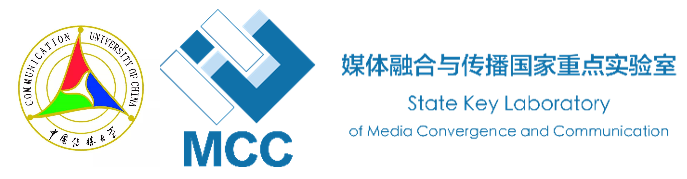

<div align="center">
  
  
  <div>&nbsp;</div>

  <div align="center">
  </div>
  <div>&nbsp;</div>
</div>

# 视频增强处理应用轻量版
## 作者：中国传媒大学——李金京

## 应用介绍

这是我自己的毕业设计，所以只公开了超分辨率、视频对比功能和一小部分预训练模型，视频插帧、HDR成像以及超分光流可视化功能可以私下交流。

## Some Demos:
## TODO

## 安装Installation

**Step 1.**
Install Anaconda.
Install PyTorch following [official instructions](https://pytorch.org/get-started/locally/).

CUDA >= 11.4 

NVCC和CUDA匹配即可

**Step 2.**
Install MMCV with [MIM](https://github.com/open-mmlab/mim).

```shell
pip3 install openmim
mim install mmcv-full
```

Linux直接pip安装mmcv-full应该没什么问题，但是对于Windows用户，需要保证NVIDIA面板、CUDA版本以及PyTorch三者直接的版本相互匹配，最后再在MMCV官网上安装对应版本的mmcv-full即可。


**Step 3.**
下载预训练模型：

[BasicVSR++](https://pan.baidu.com/s/1eD97-72t_bHu-rMya4s60g) 提取码：rqa4 

[EDVR](https://pan.baidu.com/s/1yrTdhDzuW6h526oPJhpwxA) 提取码：tp61  

[视频插帧](https://pan.baidu.com/s/1H_c8NBwOznkbw1FPbE9gFw) 提取码：6kx7

说明：BasicVSR++和EDVR的预训练模型下载后分别存放在model/weight/basicvsr_pp和model/weight/edvr下面；视频插帧的模型flownet.pkl存放在train_log/下面即可。

**Step 4.**
```shell
git clone https://github.com/ACALJJ32/super_resolution_demo_light.git

cd 
pip install -r requirements.txt
streamlit run 应用介绍.py
```

## Wechat


## 核心代码推荐阅读

[BasicVSR_pp video2frame](http://t.csdn.cn/BwRk9) 

[BasicSR&&Super-resolution——Video2video](http://t.csdn.cn/u5KWG)

[MMEditing如何添加自己的新模型](http://t.csdn.cn/XYUr1)

[BasicVSR（CVPR2021）复现](http://t.csdn.cn/BmqsC)